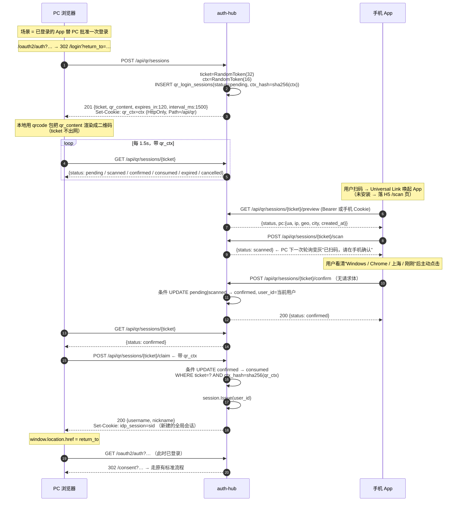
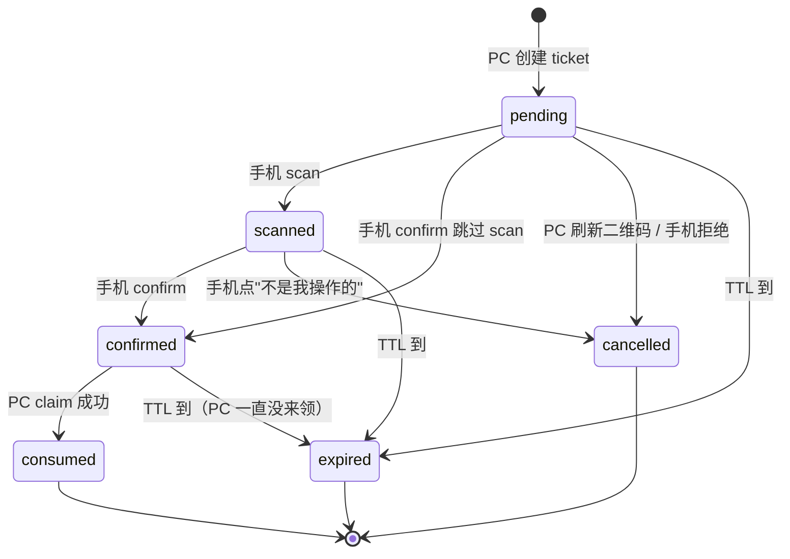

# 手机扫码统一登录 · 设计文档

> 状态：**已实现并通过验收**（2026-10-11）。实现与本文的差异集中记在文末 §15。
> 范围：设计 + 落地。代码见 `auth-hub/internal/logic/qr`、`auth-hub/web/idp-web/src/pages/QrPanel.tsx`、
> `template-qr-client/`、`e2e/tests/qr-login.spec.ts`。
> 范围：仅设计。评审通过后再按 §12 的分期落地代码。
> 前置阅读：README §5（OIDC 端点）、§7（数据表）、§8（安全设计要点）、§14（非目标）
>
> **路径基准**：Go 侧路径统一相对 `auth-hub/`；文中 `logic/…`、`controller/…`、`api/…`
> 是 `internal/logic/…`、`internal/controller/…`、`api/…` 的简写。
> `nginx.conf` 指 `auth-hub/web/idp-web/nginx.conf`，`Dockerfile` 指仓库根的 `Dockerfile`，
> 前端路径相对 `auth-hub/web/idp-web/`。

---

## 1. 结论先行

**扫码不是一种新的授权协议，而是"输密码"的替代动作。**

PC 浏览器仍然走完全不变的标准流程：`/oauth2/auth` → 发现未登录 → 302 到 `/login?return_to=…`。
只是登录页多了一个"扫码"分支：手机 App（已登录）扫码并确认后，服务端**在 PC 自己发起的领取请求上**下发
`idp_session` 全局会话 Cookie。PC 拿到会话后 `window.location.href = return_to`，重新进入
`/oauth2/auth`，此时它已登录，于是继续走 `/consent` → 授权码 → PKCE 换 token。

这条路线带来四个决定性好处：

1. **手机端不需要是 OIDC 客户端。** 它只是一个"已登录的设备"，用已有的 access_token 调一个确认接口即可，
   完全绕开了本仓库当前的硬约束：`logic/oidc/oidc.go:170` 的 `ValidRedirectURIs` 只放行
   `127.0.0.1` / `localhost` 的端口通配，自定义 scheme 与 Universal Link 的注册能力目前不存在（§11 详述）。
2. **不新增 grant_type。** `/oauth2/token`（`controller/oidc/oidc.go:279-288` 明确拒绝其它 grant）与
   discovery 的 `grant_types_supported` 都不用动，所有已接入的业务方零改动。
3. **不需要 CORS。** PC 和手机都只与 `IDP_ISSUER` 同源通信。项目现在完全没有 CORS 中间件，
   而任何"前端跨源直连"的替代方案都会被迫引入它。
4. **consent 依然保留。** 扫码解决的是"你是谁"，不是"你允许这个应用拿到你的 profile/email"。
   两者混为一谈是扫码登录最常见的安全降级。

作为代价，需要新增一张短期状态表、八个端点（§6）和一段 PC 轮询。这是本方案全部的复杂度。

---

## 2. 依赖的现有实现事实（已逐一核对代码）

设计建立在这些既有行为上，评审时可对照检查我是否理解有误：

| # | 事实 | 锚点 |
|---|---|---|
| 1 | 全局会话 = `user_sessions` 表一行 + `idp_session` Cookie；`session.Issue(ctx, userID)` 生成 `utility.RandomToken(32)`（32 字节 crypto/rand → 43 字符 RawURL），TTL 8 小时，**无滑动续期** | `internal/logic/session/session.go:22-35`、`internal/consts/consts.go:34,56` |
| 2 | Cookie 由唯一入口下发：`Path:"/"`、`HttpOnly:true`、`MaxAge`，**未显式设置 `Secure` 与 `SameSite`**。注意 gf 的 `SetHttpCookie` 是把 `*http.Cookie` 原样交给 `net/http`、并不补默认值，所以 `Set-Cookie` 里根本没有 `SameSite` 属性；"相当于 Lax" 是**浏览器对无属性 Cookie 的默认行为**，不是框架写进去的 | `internal/controller/response/response.go:74-83` |
| 3 | `/oauth2/auth` 判定登录态后：未登录 302 `/login?return_to=<urlEncode(/oauth2/auth?原始query)>`，已登录 302 `/consent?<原始query>` | `internal/controller/oidc/oidc.go:143-154` |
| 4 | 授权请求**不在服务端留痕**：consent 的全部参数靠浏览器 URL 往返，`POST /api/consent` 再把它们提交回来 | `api/oidc/v1/oidc.go:95-110`、`controller/oidc/oidc.go:202-254` |
| 5 | 登录成功后前端用 `window.location.href = res.return_to` 整页跳转，**不是** SPA `navigate` | `web/idp-web/src/pages/Login.tsx:43` |
| 6 | 一次性凭据的原子核销范式（本项目最好的并发样板）：`Transaction` + 条件 `UPDATE … WHERE used_count < max_uses` + `gdb.Counter` 自增，`affected==0` 即回滚业务错误 | `internal/logic/invite/invite.go:467-491` |
| 7 | 新列**必须**写成 `ALTER TABLE … ADD COLUMN IF NOT EXISTS`；对已存在的表 `CREATE TABLE IF NOT EXISTS` 什么都不做 | `internal/db/ddl/schema.sql:32-36` |
| 8 | 路由集中在唯一清单 `internal/router/router.go`，显式注册 + 泛型适配器 `call[Req](fn)`；控制器返回 `error` 只代表"未预期内部故障"，可预期失败就地写响应并返回 `nil` | `internal/router/router.go:33-104`（清单）、`:110-158`（`handler`/`call`/`adminCall` 三种适配器） |
| 9 | 已有 Bearer → 用户的现成校验（`/oauth2/userinfo` 在用），扫码确认端点可直接复用它解析 App 带来的 token。但要注意：**userinfo 的回落分支不是 Cookie**，而是 `access_token` 查询参数（`api/oidc/v1/oidc.go:140`）；Cookie 侧的身份解析另有其人，是 `SessionUser`（`controller/oidc/oidc.go:460-462`）。§6.2 要把这两条拼起来用 | `controller/oidc/oidc.go:353-357` → `logic/oidc.UserInfo(ctx, token)` |
| 10 | 全仓库**零** QR / 轮询 / SSE / WebSocket 代码；两个前端都无 qrcode 依赖；Go 侧 `gorilla/websocket` 仅为 indirect | 已 grep 确认 |
| 11 | 明确声明的非目标：HTTPS、分布式会话/集群 | README §14 |

⚠️ 事实 11 与"手机扫码"存在真实冲突，见 §11。

---

## 3. 完整时序



最后一跳刻意复用 `/consent`，不新增"扫码即已同意授权"的旁路。

---

## 4. 状态机与原子迁移



四条不变量，全部靠**单次条件 UPDATE 的 `affected` 行数**保证，不靠"先读再写"：

```sql
-- ① 手机 scan：只有第一个扫的人能改变状态
UPDATE qr_login_sessions SET status='scanned', scanned_at=$now, scan_ua=$ua, updated_at=$now
 WHERE ticket=$1 AND status='pending' AND expires_at > $now;

-- ② 手机 confirm：并发双击只放行一次
UPDATE qr_login_sessions SET status='confirmed', user_id=$uid, confirmed_at=$now,
                             confirm_ua=$ua, updated_at=$now
 WHERE ticket=$1 AND status IN ('pending','scanned') AND expires_at > $now;

-- ③ PC claim：只有配了正确 qr_ctx、且第一个到达的请求能领取
UPDATE qr_login_sessions SET status='consumed', consumed_at=$now, updated_at=$now
 WHERE ticket=$1 AND status='confirmed'
   AND ctx_hash = sha256($qr_ctx) AND expires_at > $now;

-- ④ 手机拒绝 / PC 作废
UPDATE qr_login_sessions SET status='cancelled', updated_at=$now
 WHERE ticket=$1 AND status IN ('pending','scanned');
```

> 注意 ③ 与现有 `ConsumeAuthorizationCode`（`logic/oidc/oidc.go:246-281`）的差别：
> 后者是 SELECT 校验完再 `UPDATE used_at`，读与写之间有窗口，理论上可被并发重复兑换。
> 授权码有 PKCE 兜底所以问题不大，但**扫码的 claim 直接决定"谁拿到登录态"，必须用条件 UPDATE**，
> 语义对齐邀请码核销（事实 6）。这是本设计里唯一一处"比现状更严格"的要求，不要退回去。

`claim` 成功后**必须**在同一个事务外、但同一请求里 `session.Issue` + `SetSessionCookie`：
先迁移状态再建会话。若反过来（先建会话再迁移状态），并发下两个 claim 都会各自建一条会话，
只有一条被记录，另一条变成无人认领的僵尸会话。

---

## 5. 数据表设计

新表没有 `o_auth_*` 那种 GORM 历史包袱，按 `consts.go:26-28` 已确立的口径取名：**复数蛇形**。

```sql
-- 扫码登录的短期票据状态。
-- 生命周期以分钟计，但它是全平台写入频率最高的表（每次登录尝试一行），
-- 所以必须自带清理（§7 的 sweeper），不能像现有 user_sessions 那样无限堆积。
CREATE TABLE IF NOT EXISTS "qr_login_sessions" (
    "id"           BIGSERIAL    PRIMARY KEY,
    -- 票据本身。qr_ 前缀只是为了日志里一眼认出它是什么，不承担识别职责
    "ticket"       VARCHAR(64)  NOT NULL,
    -- ⚠️ 只存 qr_ctx 的 SHA-256，不存原文。这张表被拖走也换不出可领取的浏览器
    "ctx_hash"     VARCHAR(64)  NOT NULL,
    -- pending / scanned / confirmed / consumed / cancelled / expired
    "status"       VARCHAR(16)  NOT NULL DEFAULT 'pending',
    -- confirm 时写入：谁批准了这次登录。pending 期为 NULL
    "user_id"      BIGINT,
    -- ↓ 这三个字段是"给手机上看的"，是防转发攻击的核心信息，创建时从请求侧采集
    "pc_ua"        VARCHAR(255),
    "pc_ip"        VARCHAR(64),
    "pc_geo"       VARCHAR(128),
    -- ↓ 审计：哪个设备扫的、哪个设备确认的
    "scan_ua"      VARCHAR(255),
    "confirm_ua"   VARCHAR(255),
    "expires_at"   TIMESTAMPTZ  NOT NULL,
    "scanned_at"   TIMESTAMPTZ,
    "confirmed_at" TIMESTAMPTZ,
    "consumed_at"  TIMESTAMPTZ,
    "created_at"   TIMESTAMPTZ,
    "updated_at"   TIMESTAMPTZ
);
CREATE UNIQUE INDEX IF NOT EXISTS "idx_qr_login_sessions_ticket"    ON "qr_login_sessions" ("ticket");
CREATE INDEX        IF NOT EXISTS "idx_qr_login_sessions_expires_at" ON "qr_login_sessions" ("expires_at");
CREATE INDEX        IF NOT EXISTS "idx_qr_login_sessions_user_id"    ON "qr_login_sessions" ("user_id");
```

**`return_to` / `client_id` 一律不入表、不下发给手机。** 这是刻意的：ticket 只代表"某台 PC 想登录"，
不代表"登录完要去授权哪个应用"。一旦把授权请求绑进 ticket，攻击者就能构造一张
"`/oauth2/auth?client_id=攻击者应用` 的二维码"，让受害者的账号替他完成授权 —— 那时扫码就从
"登录方式"退化成"授权代理"，也就失去了 §1 里第 1 条安全性。`return_to` 由 PC 存在自己的内存里。

配套常量加在 `internal/consts/consts.go`：

```go
// ── 扫码登录 ────────────────────────────────────────────────────────────────
const (
    // TableQRLoginSession 扫码票据表。写入频率高、生命周期短，靠 sweeper 清理
    TableQRLoginSession = "qr_login_sessions"
    // QRCtxCookieName 把 ticket 与"发起创建的那台浏览器"绑死，防二维码转发
    QRCtxCookieName = "qr_ctx"
    // QRTicketPrefix 仅用于日志可读性
    QRTicketPrefix = "qrt_"
    // QRTicketTTL 120 秒。60 秒不够：用户要从兜里掏出手机、解锁、找到 App
    QRTicketTTL = 120 * time.Second
    // QRPollIntervalMS 建议给前端的轮询间隔。1.5s 下 120s 共约 80 个请求
    QRPollIntervalMS = 1500
)
```

---

## 6. API 契约

全部落在 `/api/qr/…` 前缀下 —— 已被 `nginx.conf:59` 的 `location /api/` 反代覆盖，**部署侧零改动**。

### 6.1 PC 侧（匿名可调，靠 qr_ctx 绑定）

| 方法 | 路径 | 说明 |
|---|---|---|
| `POST` | `/api/qr/sessions` | 创建票据。响应 `Set-Cookie: qr_ctx` |
| `GET` | `/api/qr/sessions/{ticket}` | 轮询状态。**只读、无副作用** |
| `POST` | `/api/qr/sessions/{ticket}/claim` | 领取登录态（唯一下发 `idp_session` 的地方） |
| `POST` | `/api/qr/sessions/{ticket}/cancel` | 作废并换一张新二维码 |

**为什么轮询和领取要拆成两个端点**（而不是轮询到 `confirmed` 时顺手 `Set-Cookie`）：
手机也要查状态。如果 `GET` 自带"命中 confirmed 就下发会话"的副作用，那么手机 App 打开确认页时
调的这一次查询就会把 PC 的会话建立掉 —— 而 `Set-Cookie` 落在手机浏览器上，PC 永远领不到。
读写分离之后，`GET` 是纯查询，`POST /claim` 只有 PC 会调。

`POST /api/qr/sessions` → `201`

```json
{ "code": 0, "data": {
    "ticket": "qrt_9fJ3…",
    "qr_content": "https://auth.example.com/scan?t=qrt_9fJ3…",
    "expires_in": 120,
    "interval_ms": 1500
} }
```

`Set-Cookie: qr_ctx=<16字节随机>; Path=/api/qr; Max-Age=120; HttpOnly; SameSite=Lax; Secure`

`GET /api/qr/sessions/{ticket}` → `200`

```json
{ "code": 0, "data": { "status": "scanned" } }
```

> ⚠️ **反探测**：此响应必须带 `Cache-Control: no-store`（否则代理/浏览器缓存会让 PC 看到过期状态）。
> 并且当请求方**没有携带可匹配的 `qr_ctx`** 时，一律返回 `{"status":"pending"}`，
> 不暴露真实进度。ticket 是 `RandomToken(32)` → 32 字节 = 256 bit 熵（比邀请码的 96 bit 还宽），
> 沿用 `router.go:55-59` 那个既有论证：真正的防护是熵而不是模糊报错。至于"某人已经扫过了"这类
> 进度信息，它对旁观者没有任何价值，就不该给。

`POST …/claim` 成功 → `200` + `Set-Cookie: idp_session=…`

```json
{ "code": 0, "data": { "username": "test", "nickname": "测试账号" } }
```

失败（`qr_ctx` 缺失/不匹配、状态非 confirmed、已过期）→ `400 {code:1, error:"qr_not_ready"}`，
**不下发任何 Cookie**。状态非 confirmed 与 ctx 不匹配统一回同一个 `error`，不给探测者区分信号。

### 6.2 手机侧（需已有身份）

| 方法 | 路径 | 说明 |
|---|---|---|
| `GET` | `/api/qr/sessions/{ticket}/preview` | 确认页取 PC 设备信息展示 |
| `POST` | `/api/qr/sessions/{ticket}/scan` | 标记已扫码，驱动 PC 端"已扫码"态 |
| `POST` | `/api/qr/sessions/{ticket}/confirm` | **唯一的授权动作**，写入 user_id |
| `POST` | `/api/qr/sessions/{ticket}/refuse` | 「不是我操作」：作废票据。终态票据不可拒绝 |

鉴权口径：**同时接受 Cookie 会话与 Bearer access_token**。

```go
// 这是新写的组合，不是照抄某个既有端点：Bearer 分支复用 userinfo 的令牌解析口径
// （controller/oidc/oidc.go:353-357 —— 注意 userinfo 在没有 Bearer 时回落的是
// `access_token` 查询参数而不是 Cookie，见 api/oidc/v1/oidc.go:140），
// Cookie 分支复用 SessionUser 的会话口径（controller/oidc/oidc.go:460-462）。
// 两条拼起来才是"App 用 token、H5 用 Cookie"都能认。
func resolveMobileIdentity(ctx, r) (*entity.User, error) {
    if h := r.Header.Get("Authorization"); strings.HasPrefix(h, "Bearer ") {
        res, err := oidc.UserInfo(ctx, strings.TrimPrefix(h, "Bearer "))
        // …
        return res.User, nil
    }
    return session.CurrentUser(ctx, r.Cookie.Get(consts.SessionCookieName).String())
}
```

`preview` → `200`

```json
{ "code": 0, "data": {
    "status": "scanned",
    "pc": { "ua": "Chrome 141 / Windows 11", "ip": "203.0.113.7",
             "geo": "中国 上海", "created_at": "2026-10-10T19:02:11+08:00" }
} }
```

> `ua` 必须由**服务端**解析（新加 `internal/utility/useragent.go`，50 行足够：粗粒度浏览器名 + OS），
> 不能把原始 UA 字符串直接扔给手机渲染 —— 用户看 `Mozilla/5.0 (Windows NT 10.0; Win64; x64) …`
> 等于没看。这条信息是整个防转发机制的着力点，可读性就是安全性。

### 6.3 错误码（沿用 `invite.Error{Kind, Code, Msg}` 的模型：Kind→HTTP 状态，Code→前端可判分支，见 `logic/invite/invite.go:41-56,80-83`）

| `error` | HTTP | 触发 |
|---|---|---|
| `qr_not_found` | 404 | ticket 不存在（含已被 sweeper 清理） |
| `qr_expired` | 410 | 已过期 |
| `qr_not_ready` | 400 | claim 时状态非 confirmed，或 ctx 不匹配（合并，不给探测信号） |
| `qr_already_used` | 409 | 已 consumed / 重复 confirm / 重复 claim |
| `qr_state_conflict` | 409 | scan/confirm 抢态失败（并发） |
| `unauthenticated` | 401 | 手机侧无有效凭证。前端/ App 据此跳登录 |

---

## 7. 后端改动清单（逐文件）

| 文件 | 改动 |
|---|---|
| `internal/consts/consts.go` | 新增 8 个常量（表名/Cookie 名与 Path/票据前缀与字节数/轮询间隔/TTL/保留期），分处「表名」「有效期」「扫码登录」三个块内 |
| `internal/db/ddl/schema.sql` | 新增 `qr_login_sessions` DDL（§5）。整段用 `CREATE TABLE IF NOT EXISTS`，本表是新建，无需 `ALTER` |
| `internal/dao/dao.go` + `internal/dao/internal/columns.go` | 新增 `QRLoginSession` DAO 与列名常量。列名必须进 `columns.go`，业务代码里不出现裸字符串（`consts.go` 包注释的既有约定） |
| `internal/model/entity/entity.go` + `internal/model/do/do.go` | 新增 `QRLoginSession`（读）与 `QRLoginSessionDo`（写） |
| **`internal/logic/qr/qr.go`（新包）** | 状态机唯一实现：`Create` / `Peek` / `Scan` / `Confirm` / `Claim` / `Cancel` / `Purge`。四个条件 UPDATE 全部在此，控制器不许自己拼 SQL。错误模型抄 `logic/invite`：`qr.Error{Kind, Code, Msg}` |
| `internal/utility/useragent.go` | 新增 `Summarize(ua string) string` |
| **`internal/controller/qr/qr.go`（新包）** | 8 个 handler。用 `g.RequestFromCtx(ctx)` 取 `r`（既有范式）。`claim` 是唯一会 `SetSessionCookie` 的地方 |
| `api/qr/v1/qr.go`（新包） | 8 组 Req/Res 结构体，带 `g.Meta`（path 与 router 保持一致，虽然只是声明性的） |
| `internal/router/router.go` | 公开组内加 8 条路由：**6 条 `group.POST`（create / claim / cancel / scan / confirm / refuse）+ 2 条 `group.GET`（轮询 / preview）**，全部走 `call[qrapi.XxxReq](qrC.Xxx)`。手机侧 4 条**不能**挂 `RequireAdmin` —— 这个判断与 `/api/register` 的既有论证同构（`router.go:49-53`："注册不是管理员在做的事，挂上 RequireAdmin 等于把注册入口关掉"），但注意两者的差别：register 是"还没有身份"，扫码确认是"有身份但不是管理员"。身份校验放在 controller 里自查，这一点抄 `/api/consent`（它在 `router.go:63-64` 注册时没有注释说明，自查逻辑在 `controller/oidc/oidc.go:205-212`） |
| `internal/controller/response/response.go` | 新增 `SetQRCtxCookie(r, ctx, ttl)`（`Path:"/api/qr"`）与 `NoStore(r)`。**顺手补 `SetSessionCookie` 的 `Secure`/`SameSite`**，见 §11.3 |
| `internal/cmd/cmd.go` | 装配 sweeper：启动即清一次 + `time.Ticker` 每小时 `DELETE WHERE expires_at < now() - 7*24h`（保留 7 天供审计回看）。见 §11.4 |
| `internal/logic/session/session.go` | **P2**：`Issue` 增加 `login_method` 参数（`password` / `qr`），配合 `ALTER TABLE "user_sessions" ADD COLUMN IF NOT EXISTS "login_method" VARCHAR(16);` —— 事后排查"这次可疑登录是扫码来的"全靠它 |
| `README.md` | §5 端点表补扫码端点；§7 数据表补 `qr_login_sessions`；§8 安全要点补"扫码登录的转发防护依赖 qr_ctx 绑定"；§14 非目标里划掉已实现的部分 |

不改的东西（刻意确认边界）：`/oauth2/token`、discovery、JWKS、consent、所有业务方接入代码。

---

## 8. PC 前端（idp-web）改动

| 文件 | 改动 |
|---|---|
| `package.json` | 加 `qrcode`（`toDataURL` / `toCanvas`）。**必须走 npm 打进 bundle**，不能用 `api.qrserver.com` 之类在线出图 —— 项目此前正因为依赖 Tailwind CDN 离线失效而把 CDN 整个移除（`src/app.css` 头注释），把 ticket 交给第三方出图服务既是可用性风险也是泄露风险 |
| `src/api/types.ts` | `QRCreateResult` / `QRStatus`（联合类型：`'pending'\|'scanned'\|'confirmed'\|'consumed'\|'expired'\|'cancelled'`）。字段保持 snake_case 镜像 Go JSON（既有约定） |
| `src/api/endpoints.ts` | `qrApi = { create, peek, claim, cancel }` 四个函数。路径只写在这一处（文件头注释的约定） |
| **`src/components/QrPanel.tsx`（新）** | 状态 + `useEffect` 定时器。`AbortController` 卸载时清理；`document.visibilityState === 'hidden'` 时暂停轮询（笔记本合盖会积累几百个无效请求）；倒计时环形进度；`expired` → "二维码已过期 · 点击刷新"；`scanned` → 灰掉二维码 + "已在手机上扫码，请确认" |
| `src/pages/Login.tsx` | 顶部加"密码登录 / 扫码登录"两个 Tab（`app.css` 里已有 `.row` 与 BEM 工具类，够用）。`returnTo` 逻辑不动（`Login.tsx:18` 已解析好），扫码成功后**复用同一句** `window.location.href = returnTo` |

轮询实现要点：`confirmed` 后**停止轮询再 claim**，不要"轮询到 confirmed → 顺手 claim → 下一轮继续跑"。
claim 失败（票据刚好被清理）时回落到 `pending` 并提示刷新，而不是静默重试打满限流。

---

## 9. 手机端方案（App 深链优先 + H5 兜底）

二维码内容是一个 **HTTPS URL**：`{IDP_ISSUER}/scan?t={ticket}`。同一个 URL 承担两种落点：

- **装了 App** → iOS Universal Link / Android App Links 命中，系统直接唤起 App，App 内展示原生确认页。
  ticket 从 `https://auth.example.com/scan?t=…` 的 query 里取。
- **没装 App / 深链失败** → 落到 idp-web 新增的 `/scan` 路由（H5 页），手机浏览器若已有 `idp_session`
  直接可确认，否则先跳 `/login` 再回来。

这个"同一 URL、App 优先、Web 兜底"是微信/钉钉/飞书扫码的通用形态，也意味着
**服务端与 PC 侧的代码对两种落点完全无差别** —— 差别只在客户端。

### 9.1 App 侧要做的事（Flutter）

1. 深链接收：`flutter_deeplinking` / `go_router` 的 `RouteScheme`，注册 host `auth.example.com`、
   path `/scan`、query `t`。
2. 进确认页前取数：`GET …/preview`（带 App 已存的 access_token）→ 拿到 PC 的浏览器/系统/IP/归属地/时间。
3. 展示（**这一步的文案是安全边界，不要简化**）：
   > 检测到登录请求
   > Chrome · Windows 11 · 中国 上海 · 刚刚
   > **不是你本人的操作？请在手机端直接取消，并检查是否有人截取了这张二维码。**
   > `[ 取消 ]` `[ 确认登录 ]`
4. 点击顺序：`POST …/scan` → 用户点确认 → `POST …/confirm`。`scan` 与 `confirm` 分开发，
   PC 才能显示"已扫码，等待确认"这个中间态。App 若图省事只调 `confirm`，状态机也接受
   （`pending → confirmed` 合法），但会丢掉 PC 端的中间反馈。
5. 失败处理：`401 unauthenticated` → 跳 App 内登录；`409 qr_already_used` / `410 qr_expired` →
   提示"二维码已失效，请在电脑上刷新"。
6. **确认成功后的界面必须可回退**，不要让 App 因深链跳进一个死胡同页面。

### 9.2 为什么 App 不需要注册为 OIDC 客户端

App 调的是 `/api/qr/*`，凭证是**它自己已有的 access_token**，不是授权码回调。
所以它不需要 `redirect_uri`、不需要 client 注册、不触碰 `ValidRedirectURIs` 的限制。
（App 自身"首次登录拿到 token"这件事是**另一个**问题，见 §10 —— 它现在是真的走不通的。）

---

## 10. 前置阻塞项：手机端 App 自己怎么登录

这是我在调研中发现的、**必须先于扫码功能解决**的问题，评审时请先定这一条。

App 要用 Bearer 调确认接口，前提它得有 token。拿 token 只有三条路：

**A. 标准授权码 + PKCE + Universal Link 回调**（推荐）
`redirect_uri = https://auth.example.com/oauth2/callback/mobile`。
它是 https 精确匹配，**现有校验直接支持、Go 侧不用改**：`ClientAllowsRedirect`
（`logic/oidc/oidc.go:84-94`）逐个客户端比对，落到 `matchRedirectPattern`
（同文件 `:114-154`）的 `pattern == uri` 精确分支（`:115-117`），压根走不到通配逻辑。
工作量全在 App 与运维侧（Apple `apple-app-site-association`、Android `assetlinks.json`）。
代价：强制公网 HTTPS（§11.1）。

**B. 自定义 scheme 回调** `com.example.goah:/oauth2/callback`
需要同时改两处：注册时的 `ValidRedirectURIs`（`logic/oidc/oidc.go:170`，它的 scheme 白名单在
`:176-178` 只放 http/https，通配符检查在 `:180-184` 只放 loopback）与比较时的
`matchRedirectPattern`（`:114-154`，`:119-127` 那个 switch 只认 `127.0.0.1` / `localhost`），
才能允许 `app:` 形式（RFC 8252 §7.1）。改动不大但**动的是白名单校验逻辑**，
而它是整个 OIDC 实现里最不能出错的 60 行。另外 iOS 上自定义 scheme 唤起会有"来源不明"的系统提示。

**C. App 内直接调 `POST /api/login` 拿 `idp_session`**
改动最小，但在原生 App 里管理 Web Cookie 很别扭，而且拿不到 access_token（要调确认接口还得另走一条
token 路径），等于把口令登录页在 App 里重抄一遍。**不建议**：它会让 App 绕过整个 OIDC 体系，
和这个项目的立身之本冲突。

> 顺带一个必须记下的缺口：`o_auth_clients` **没有 `grant_types` 列**（`schema.sql:41-54`），
> 现在也确实用不上；但如果将来要按客户端区分能力（例如禁止某个客户端走扫码），这里要先补。

---

## 11. 风险与既有实现的冲突（逐条给结论）

### 11.1 HTTPS 缺失 → Universal Link 方案不成立

README §14 把 HTTPS 列为非目标，现有部署是 `http://<host>:8082`（`nginx.conf:9`、`Dockerfile:62`）。
而 Apple 的 Universal Link **强制要求公网 HTTPS + 有效证书 + AASA 文件不可重定向**，
Android App Links 同样要求 `assetlinks.json` over HTTPS。

结论：**在 HTTPS 落地之前，手机端只有 H5 兜底一条路可走**（App 深链退化为自定义 scheme，
即 §10 的 B 方案，需改白名单校验）。所以 §12 把 P0 定成"H5 跑通全链路"，而不是自欺欺人地先做深链。

如果决定走 Universal Link，`/.well-known/` 在 `nginx.conf:82` 是**整段反代到 Go** 的，
所以 AASA 与 `assetlinks.json` 要么由 auth-hub 新增两条静态路由提供（Android 的
`/.well-known/assetlinks.json` 正好落在前缀内），要么在 nginx 里为其加更高优先级的
`location =` 精确块从静态目录出。倾向前者：路由集中在 `router.go` 这一份清单里，符合项目习惯。

### 11.2 二维码必须"手机可扫到" → issuer 必须是公网可达地址

`IDP_ISSUER` 同时决定 `qr_content` 的 host，而它的默认值是 `http://127.0.0.1:8080`
（定义在 `internal/config/config.go:51-52`，不在 `consts.go` 里）。裸 `go run` 时监听地址也是这个。
容器化部署虽然把 `IDP_ADDR` 改成了 `0.0.0.0:8080`（`Dockerfile:56-57`）让端口对外可连，
但只要 issuer 没换成公网地址，二维码内容依旧指向手机根本打不开的本机地址 ——
**卡点在 issuer，不在监听地址**，这两者容易被混为一谈。
这是"issuer = 对外可达地址"这条既有约束（`nginx.conf:6-14` 已 warn 过它对 OIDC 的影响）
在扫码场景下的新表现，值得在 README 里补一句。

### 11.3 Cookie 属性

`SetSessionCookie`（`response.go:74-83`）不设 `Secure`/`SameSite`。要说清它今天到底靠什么：
gf 的 `SetHttpCookie` 把 `*http.Cookie` 原样交给 `net/http`、**不补任何默认值**，
所以发出去的 `Set-Cookie` 头里压根没有 `SameSite` 字段；"表现为 Lax" 是**浏览器**对无属性
Cookie 的默认处置。也就是说这一层防护不在我们代码里，是浏览器给的 —— 这种"隐式契约"最容易被
下一次改动悄悄破坏。扫码流程会明显放大这个短板：`claim` 与手机确认都是写操作。当前结论：

- **CSRF 层面今天是安全的**，但依赖的正是上面那条浏览器默认行为。既然要新增写端点，
  就在这一版里把它显式化：`SameSite: Lax` 明写、`Secure` 随 HTTPS 一起开
  （可配置，避免 HTTP 开发环境直接登不上）。
- `qr_ctx` 用 `Path=/api/qr` 收敛作用域，不给它全局可见性。

### 11.4 无 GC 的堆积问题

**auth-hub 侧没有任何清理任务**：`user_sessions` 过期行永久留存（`session.Issue` 只 INSERT，
`session.go:22-35`；`Destroy` 只按 sid 删，`:99-101`）。
倒是业务模板那边有现成先例可参照 —— `template-business-server/api/refresh.go:224` 会调
`db.DeleteExpiredSessions`（`template-business-server/db/db.go:288-289`，注释就写着
"清理已整体过期的会话，避免表无限增长"）。
`qr_login_sessions` 的写入频率远高于 `user_sessions`（每次登录尝试一行，过期未领取的也是一行），
**不能沿用 auth-hub 现状**，所以 §7 硬性要求装配清理任务。
建议顺手把 `user_sessions` / `oauth_authorization_codes` 的清理并到同一个 ticker 里 ——
一次改完，不留半拉子。

### 11.5 限流

项目今天没有任何限流（README §14 的口径是"没有开放注册入口，所以不需要限流"）。
扫码引入了两个新的匿名可写入口，需要补最低限度：

- `POST /api/qr/sessions`：按 IP 令牌桶，比如 10 次/分钟。不加的话任何人都能低成本制造数据库行。
- `POST …/confirm`：按 user 限制，比如 5 次/分钟，避免被用来批量领取。

一个内存计数器就够，不引入 Redis（与"不做集群"的边界一致）。

### 11.6 会话新鲜度（暂不做，列为 P2）

严格来说"手机上有个 8 小时会话"就批准新设备登录，信任链偏长 —— 手机锁在抽屉里时
Session 依旧有效。理想做法是要求"批准扫码的那个会话本身是 5 分钟内认证的"，
这需要 `user_sessions` 有 `auth_time`（当前没有；`users.last_login_at` 是账号级不是会话级）。
一期用"App 走 Bearer access_token，10 分钟 TTL，必须有活跃 App 会话"部分覆盖，
H5 路径则确实存在这个窗口。列为 P2，别在评审时误以为已经解决了。

---

## 12. 分期

**P0 · 服务端 + H5 全链路闭环（不依赖 HTTPS，可完整验收）**
`qr_login_sessions` 表 + `logic/qr` + 控制器 + 路由 + Cookie 绑定 + sweeper + 限流；
idp-web 的 `QrPanel` 与 `/scan` H5 页；单测 + Playwright 双 context e2e。
交付判定：两台设备（PC 与手机浏览器，各自独立会话）能走完 §3 的完整时序。

**P1 · Flutter App 深链**
前置：HTTPS + §10 选定 A 或 B。AASA / assetlinks 落地、App 内确认页、
`resolveMobileIdentity` 的 Bearer 分支联调、深链失败自动回落 H5 的验证。

**P2 · 增强**
`login_method` 审计列、会话新鲜度、SSE 替换轮询（需给该路径加 `proxy_buffering off`，
与"不做集群"边界冲突，届时重新评估）、管理后台展示扫码记录、IP 归属地库。

---

## 13. 测试方案

**Go 单测**（`internal/logic/qr/qr_test.go`，走 `internal/testpg` 的一次性 schema）

- 状态机 4 条条件 UPDATE 的合法/非法迁移矩阵（重点：`consumed → confirmed` 必须失败）
- **并发**：`go test -race`，10 个 goroutine 同时 `confirm` → 恰好 1 个成功；
  10 个同时 `claim` → 恰好 1 个成功且只建 1 条 `user_sessions`
- `qr_ctx` 不匹配的 `claim` → `qr_not_ready` 且**无 `Set-Cookie`**
- TTL 边界；`Purge` 只删过期 7 天以上的行
- 复用 `ConsumeAuthorizationCode` 那批已有 fixture，避免为新功能再造一套 PG 脚手架

**Playwright e2e**（`e2e/tests/qr-login.spec.ts`）

关键手法：**同一次 `browser.launch()` 下开两个 `browser.newContext()`** 当作 PC 与手机。
context 之间 Cookie/storage 天然隔离，这正是扫码流程要的隔离性；用两个不同 browser 实例也行但慢。

- 正向：PC 建码 → 手机 context 打开 `/scan?t=…` → 手机登录 → 确认 → PC 轮询到 confirmed →
  claim → PC 落在 `/consent` → 继续走完 PKCE → 业务方已登录
- `qr_ctx` 缺失（用 `request` fixture 手动发不带 Cookie 的 claim）→ 400 且 PC 仍 pending
- 转发攻击：手机确认后，**另一个 context** 拿同一 ticket 去 claim → 失败
- 过期：把 `QRTicketTTL` 通过测试配置压到 3s → PC 显示"已过期"
- 手机点"取消" → PC 回落到可刷新状态

---

## 14. 需要你拍板的四个开放问题

1. **§10**：App 自身的登录走 A（Universal Link，需先上 HTTPS，Go 侧不改）还是 B（自定义 scheme，需改
   `ValidRedirectURIs` 白名单校验）？这决定 P1 的全部形态。
2. **§11.1**：认证中心在可预见的将来能否提供公网 HTTPS？没有的话 App 深链方案要整体推迟。
3. **§1**：是否同意"扫码只建立全局会话、**仍然弹 consent**"？免 consent 体验更顺，
   但会把"登录"和"授权"两件事混成一个动作，我建议保留。
4. **§11.3 / §11.5**：`Secure`/`SameSite` 显式化与最简限流，是否一并放进 P0？
   我倾向放进来 —— 都要新增写端点，顺手做掉比留成"已知隐患"便宜。

---

## 15. 实现结果与本文的偏差（2026-10-11 落地记录）

功能已实现并验收通过。以下是**与本文不同**的地方，以及为什么改。

### 15.1 端点从 7 个变成 8 个

新增了 `POST /api/qr/sessions/{ticket}/refuse`。本文 §9.1 让手机端显示
「不是你本人的操作？请在手机端直接取消」，但 §6 只设计了 `cancel` 一个作废端点，
而 `cancel` 要求 `qr_ctx` —— **手机拿不到它**（那在 PC 浏览器里）。
所以"手机点取消"在 7 端点方案下无法实现。`refuse` 与 `cancel` 做的是同一种状态迁移，
区别只在授权来源：前者是手机侧身份，后者是票据上下文。
两者在 `logic/qr` 里也是两个函数（`Refuse` / `CancelByPC`）而不是一个带
`requireCtx bool` 参数的函数 —— 调用点写成 `Cancel(ctx, t, true)` 三个月后没人知道
那个 `true` 是"要校验"还是"不校验"。

### 15.2 状态常量放在 entity 包，不放 consts

本文 §5 把状态值与 TTL 混在一起列。实际实现按仓库既有分工拆开：
表名/Cookie 名/TTL/字节数在 `consts.go`（8 个），
状态取值 `QRStatus*` 与 `EffectiveStatus()` 在 `model/entity`（跟着读出来的行走）。

`EffectiveStatus()` 这个读取侧函数是设计稿里没有的，它解决一个真实缺陷：
库里**不写** `expired` 这个值，过期与否由 `expires_at` 判定。如果只靠定时任务改写状态，
服务重启期间没人跑批，就会出现"`expires_at` 早过了、`status` 还是 pending"的行 ——
症状是前端一直转圈，而排查的人以为是轮询坏了。

### 15.3 `preview` 的时间字段改为 RFC3339

设计稿 §6.2 的示例把 `created_at` 写成服务端格式化好的串。实现时改成 RFC3339：
Go 从库里读出的 `time.Time` 带 UTC 偏移，服务端 `Format("2006-01-02 15:04:05")`
会把本地 23:55 印成 15:55 —— **差 8 小时的恰好是用户用来判断"是不是我刚刚发起的"那个字段**，
等于让最要紧的界面说谎。现在由展示层（`fmtTime` / CLI 的 `_fmt_when`）本地化。

### 15.4 未实现的两项（原 P0 清单内）

- **限流**（§11.5）：`POST /api/qr/sessions` 目前仍匿名可无限调用。
  这是本次实现里**唯一一处明知未完成却上线的 P0 项**，风险是数据库行数可被低成本堆高
  （已有 sweeper 兜住 7 天保留期，但挡不住短期灌入）。
- **IP 归属地**（§6.2 的 `geo`）：只做到 `本机 / 内网 / 公网` 三档分类（`utility.ClassifyIP`），
  没有城市级归属地。理由是不愿为此给认证中心加一份几 MB 的 IP 库，
  也不愿在登录链路上引入外部查询的超时风险。

### 15.5 验收结果

| 层次 | 手段 | 结果 |
|---|---|---|
| 状态机 | `internal/logic/qr` 11 个测试函数（真 PG 一次性 schema） | 全绿，含并发 scan/confirm/claim 各只放行 1 个 |
| 协议层负向 | `template-qr-client` 的 `goah-qr security` 7 项 | 7/7 通过 |
| 装配层 | `internal/router` 新增 2 测：路由表自省 + 手机侧四条匿名 401 | 全绿 |
| 页面 | `e2e/tests/qr-login.spec.ts` 3 测（双 context 真实浏览器） | 3/3 通过，5 张截图存 `e2e/screenshots/` |
| 端到端 | `goah-qr demo` | PC 领到会话并经 `/api/me` 自证身份为 `test` |
| 回归 | `go test ./...` 全量 | 无包失败 |

**负向对照实验**（这一条值得单独记，因为它是上面那些绿色的可信度来源）：
临时把 `Claim` 里的 `qr_ctx` 约束删掉重新编译，`security` 套件中
`ctx_not_interchangeable` 立刻报红，而其余 6 项照旧绿 —— 证明这套检查**确实能检出**
被拆掉的防线，且各项之间可区分（`forward_attack` 走的是"无 ctx"分支，不受影响）。
随后逐字恢复并用 Go 单测复验。

一个"永远不会失败"的安全测试比没有测试更糟，因为它会让人以为防住了。

### 15.6 本地跑法备忘

```bash
# 认证中心（务必用独立 schema，别指向生产的 auth_hub）
cd auth-hub && IDP_DSN='pgsql:...?search_path=auth_hub_qrdev' \
  IDP_ISSUER='http://127.0.0.1:18080' IDP_ADDR='127.0.0.1:18080' go run .

# 客户端演示（issuer 要与 IDP_ISSUER 一致，否则二维码里的地址手机打不开）
cd template-qr-client && uv sync && uv run goah-qr demo --issuer http://127.0.0.1:18080

# 页面用例（IDP_BASE 覆盖端口；CHROMIUM_PATH 是仓库既有的离线逃生口）
cd e2e && IDP_BASE='http://127.0.0.1:18080' CHROMIUM_PATH='<cached chrome-headless-shell>' \
  npx playwright test tests/qr-login.spec.ts
```
